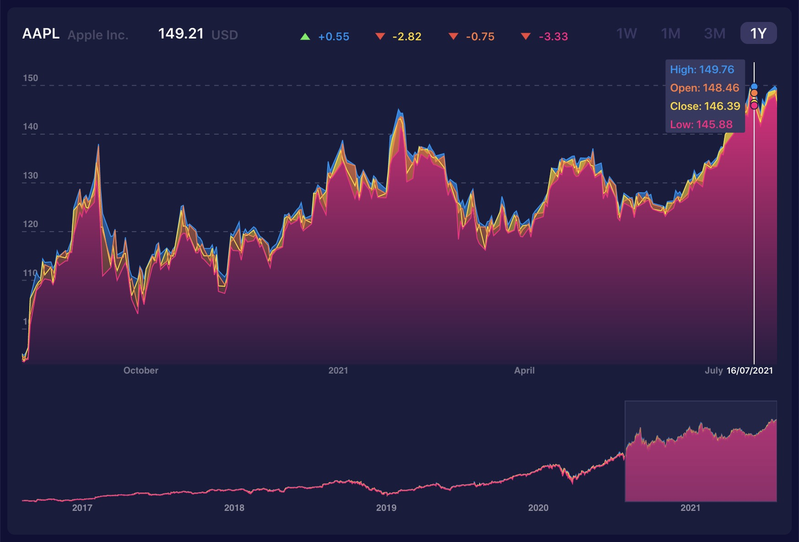

### [Stock-chart]https://rowlandwilliams.github.io/stock-chart/)

This is a React component that could be used to visualise stock data from Yahoo! Finance.

It features brush plotting and time filtering.

Technologies used:

- React
- TypeScript
- d3.js
- Redux
